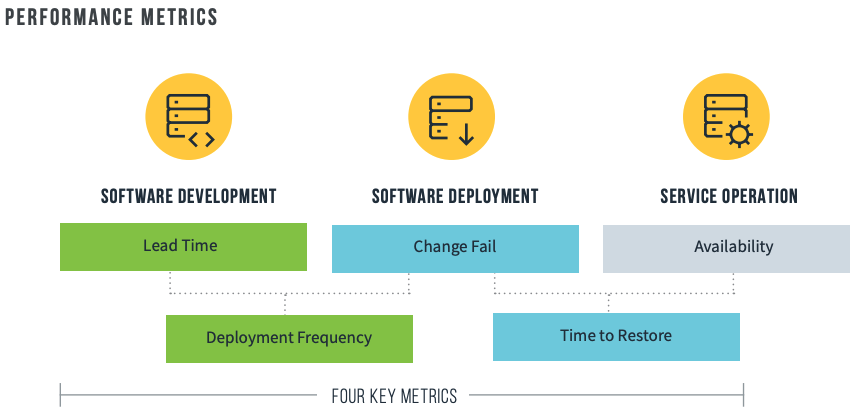
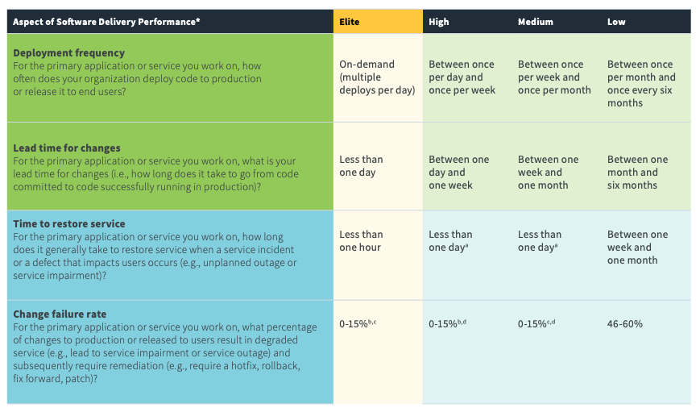
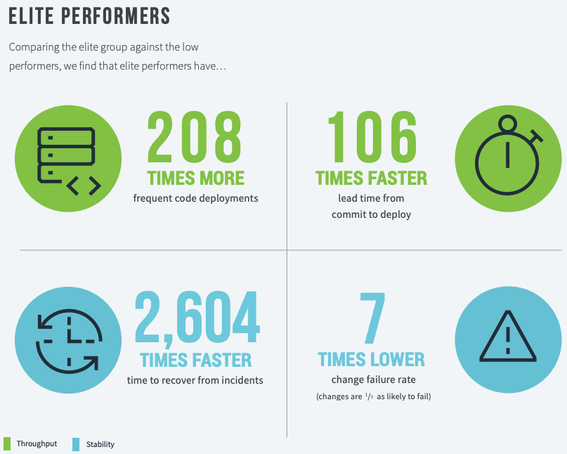
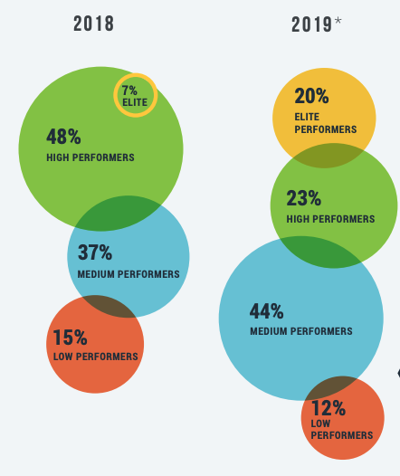
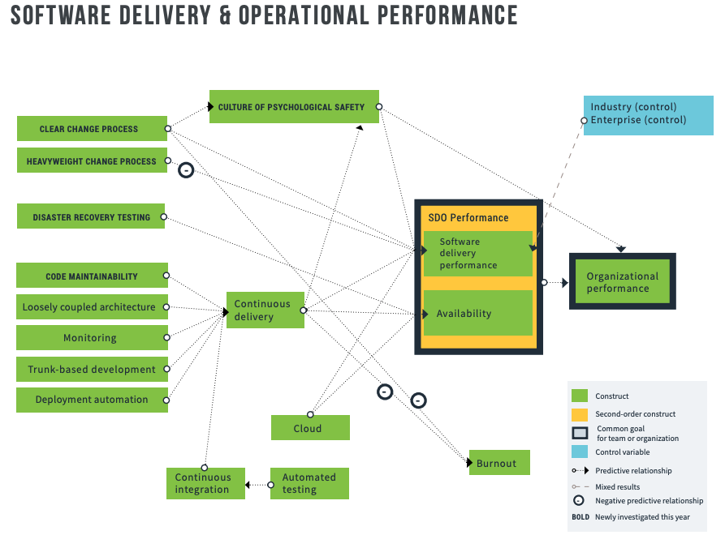

name: inverse
layout: true
class: center, middle, inverse
---

class: center, middle

# DevOps

2020/06/29 TechBall

TEC 木利友一

---
layout: false

# Agenda

1. DevOpsとは何か
2. DevOpsを何で測るか
3. DevOpsの原則

---

# DevOpsとは何か

- 何が目的なのか
- DevとOpsが仲良くすればDevOpsなのか
- 自動化すればDevOpsなのか
- ツールを導入すればDevOpsなのか
  - デプロイメントパイプラインを組めばDevOpsなのか
  - IaCしておけばDevOpsなのか

---
# 残念なDevOps

<cite>[あなたの組織は「残念なDevOps」になっていませんか？ DevOps実現のための計測の重要性【デブサミ2019夏】](https://codezine.jp/article/detail/11634)</cite>

- スーパーエンジニアに2人分の働きをしてもらうのがDevOpsである
  - 「なんでもできる人材」が求められ、組織がついていけずに疲弊する
- 社内でDevOpsを推進しようとしているものの、現場にさっぱり浸透しない
  - ウォーターフォールがメインの組織ではアプリ開発者とインフラ運用者は全く違う組織である。
  - にもかかわらず、その隔たりを解消しないままDevOpsとか言っちゃう
- DevOpsってつまり自動化ツールを導入すればいいんでしょ？
  - 必要条件ではあるが十分条件ではない

---

# DevOpsとは何か (Google)

DevOps とは、ソフトウェアデリバリーの速度とサービスの信頼性の向上、ソフトウェアの関係者間で共有するオーナー権限の構築を目的とする、組織的で文化的な仕組みです

<cite>[What is DevOps? Research and Solutions | Google Cloud](https://cloud.google.com/devops)</cite>

---

# DevOpsとは何か (Gartner)

- DevOps represents a change in IT culture, focusing on rapid IT service delivery through the adoption of agile, lean practices in the context of a system-oriented approach. DevOps emphasizes people (and culture), and it seeks to improve collaboration between operations and development teams. DevOps implementations utilize technology — especially automation tools that can leverage an increasingly programmable and dynamic infrastructure from a life cycle perspective.
- 意訳 
  - DevOpsはITに関する文化の変革であり、システム重視のアプローチを通したアジャイルやリーンの適用を通した高速なデリバリに焦点を置く。
  - DevOpsは人々（やその文化）を強調しており、OpsとDevの協調を改善しようとする。
    - DevOpsは特にプログラマブル・動的なインフラを利用した自動化ツールを用いることが多い。

<cite>[DevOps](https://www.gartner.com/en/information-technology/glossary/devops)</cite>

---

# Gene Kimの定義

- The architecture, technical practices, and cultural norms that enable us to ...
  - increase our ability to deliery application and services quickly and safely, which enables rapid experimentation and innovations, and the fastest delivery of value to our customers while ensuring world-class security, reliability, and stability so that we can win in the marketplace
- 意訳
  - アーキテクチャであり、技術的プラクティスであり、文化的な常識。何をするためかというと…
    - アプリケーションとサービスを高速かつ安全に届ける能力を強化する。それにより、
      - 高速な実験とイノベーションを実現する
      - 世界レベルのセキュリティ、信頼性、安定性を確保しながら顧客への最速の価値提供を実現する
  - それにより市場で勝てるようにする

<cite>[DevOpsDays Tokyo 2019開催。DevOpsの伝道者Gene Kimのキーノートセッションを紹介](https://thinkit.co.jp/article/16052)</cite>

---

# DevOpsとは

- 目的はビジネス・プロダクトの成功
- サービスのデリバリ速度の向上によって実現する。
- DevとOpsの協調はその手段

---
template: inverse

# DevOpsの略歴

---
layout: false

# リーン運動

- 品質・顧客満足度・従業員幸福度を引き上げるために最も大事なことは、製造のリードタイムを短縮すること
- 原則 ([リーンソフトウェア開発（りーんそふとうぇあかいはつ）](https://www.itmedia.co.jp/im/articles/0803/10/news113.html)より)
  - 無駄をなくす
  - 品質を作り込む
  - 知識を作り出す
  - 決定を遅らせる
  - 早く提供する
  - 人を尊重する
  - 全体を最適化する

---

# アジャイル

- [アジャイルソフトウェア宣言](https://agilemanifesto.org/iso/ja/manifesto.html)
  - 動くソフトウェアを頻繁・漸進的にリリース
  - 小規模・自発的な意欲を持つ組織

---

# アジャイルインフラとベロシティ活動

- [10 deploys per day: Dev & Ops cooperation at Flickr](https://www.slideshare.net/jallspaw/10-deploys-per-day-dev-and-ops-cooperation-at-flickr)
  - DevOpsの原点とされるFlickrの発表
<iframe src="//www.slideshare.net/slideshow/embed_code/key/fqqBs2mBGMeagU" width="425" height="355" frameborder="0" marginwidth="0" marginheight="0" scrolling="no" style="border:1px solid #CCC; border-width:1px; margin-bottom:5px; max-width: 100%;" allowfullscreen> </iframe> 
 <strong> <a href="//www.slideshare.net/jallspaw/10-deploys-per-day-dev-and-ops-cooperation-at-flickr" title="10+ Deploys Per Day: Dev and Ops Cooperation at Flickr" target="_blank">10+ Deploys Per Day: Dev and Ops Cooperation at Flickr</a> </strong> from <strong><a href="//www.slideshare.net/jallspaw" target="_blank">John Allspaw</a></strong> 

  - めちゃくちゃ良い内容なのでぜひご覧ください
    - 今日の説明も実はこちらを使いたかった

---

### 継続的デリバリー

- コードとインフラを常にデプロイ可能な状態に保つ
- trunk (master)にチェックインされたコードは本番環境に安全にデプロイできる

---

### トヨタのカタ

- 習慣的に業務改善を実践するという構造を作り上げる
  - 結果の改善を生むのは日々の実践
  - 何かトラブルが起きたときには即座にラインが止まってしまうようなギリギリなマゾい設定にする ()
    - > 目的が「目標生産量の達成」なら問題を回避できるシステムのほうが好ましく見えるだろうが目的が「改善し続けて生き残る」なら、自由度の高いシステムは問題の原因を知ることを困難にするから許されない。自由度の高いシステムは問題を本質的に改善しない。

<cite>https://scrapbox.io/nishio/%E3%83%88%E3%83%A8%E3%82%BF%E3%81%AE%E3%82%AB%E3%82%BF</cite>

---
template: inverse

# DevOpsを何で測るか

---

# SDO Performance

- [State of Devops 2019](https://services.google.com/fh/files/misc/state-of-devops-2019.pdf)
  - DORA (DevOps Research and Assesmet; Google が買収) のレポート
  - 6年に渡り31,000人からデータを回収し統計的に分析

## SDO Performance

Software Delivery and Operational Performance: 

---

# Four Key Metrics

- GartnerのTechnology Rader (2019)で `ADOPT` 評価
  - [Four Key Metrics](https://www.thoughtworks.com/radar/techniques/four-key-metrics)
- 企業の成功と統計的な相関がある

---

# Elite Performer

---

# Elite Performer になるのは夢物語か

# どうやって SDO Performance を向上させるか

---
template: inverse

# DevOpsの原則

---

# DevOpsの原則

1. 開発→運用→顧客の左から右へのワークフローを高速にする
1. バリューストリームのあらゆるステージで、すばやくてコンスタントな右から左へのフィードバックフローを実現すること
1. 成功と失敗の両方から組織として学習し教訓を得ていく生産的な高信頼マネジメントの企業文化を生み出す

これらの原則から導かれるプラクティスは後ほど

---

# デプロイリードタイムの重視

エンジニアが変更をチェックインしてから、当該の変更が本番環境で稼働し、フィードバック・測定データを入手するまでの時間

- よく見られるシナリオ
  - デプロイリードタイム数ヶ月
    - 最後の段階で使い物にならないことがわかる
      - マージできない
      - テストしたらうまくいかない
- 理想: 数分単位
  - ディベロッパーは自身の仕事に対するフィードバックをコンスタントに受け取る
- 実現するためには
  - 小さなコード変更をこまめにチェックイン
  - 変更に対する自動テスト
  - 本番デプロイ

---

# 組織とアーキテクチャの構築

## [コンウェイの法則](https://en.wikipedia.org/wiki/Conway%27s_law)

> システムを設計する組織は組織内のコミュニケーション構造のコピーになっているような設計しか作り出せない

## 組織のパターン

- 職能指向
  - 専門能力の育成・活用、それに伴うコスト削減
  - キャリア形成とスキル開発
- 市場指向
  - 複数の職能横断的なメンバ
  - 顧客ニーズに素早く対応

DevOps では市場指向を取ることが多い

--- 

# 職能指向を取らない理由

- 職能指向の場合、リードタイムが長くなる
  - 職能ごとにチームが構成
    - チームごとに目的が異なる
  - チーム間の受け渡しが必要
    - [Martin Fowlerの言う "Backlog Coupling"](https://martinfowler.com/articles/talk-about-platforms.html)
      - 一つのことを行おうとした時に複数のチームのバックログを積まなければならない
      - 
  - 各チームのリソースが様々なサービス開発で共用され奪い合いになる
    - リソースアサインを調整する管理職の能力がチームの限界を規定し得る

--- 

# 市場指向を取る理由

- 機能開発だけでなく、テスト、セキュリティ確保、本番環境のサービスデプロイ、サポートまでを担当する
- 職能横断的で高い独立性を持つが故に他のチームに頼らずにアジリティを発揮できる

## 現実的に無理では？

1. 各種のスキルを持った要員をチーム内に配置する
2. 自動化されたセルフサービスプラットフォームを通じてチームに職能を提供する

- [DevSecOps](https://en.wikipedia.org/wiki/DevOps#DevSecOps,_Shifting_Security_Left)
- [BizDevOps](https://ja.wikipedia.org/wiki/BizDevOps)

---

template: inverse

# プラクティス: ワークフローの高速化

---

# オンデマンドでの環境構築

- 本番環境に近い環境を早い段階で実現する
  - 日常業務の一環として本番に近い環境でコードを実行・テストでき、早い段階でフィードバックが得られる
- 既知の"良い環境"を定義し、作成を自動化する
  - 組織の集合知を体現、安定してセキュア

## さらに

何か問題が起きた時には修復するよりも再構築する

- [Immutable Infrastructure](https://ja.wikipedia.org/wiki/Immutable_Infrastructure)

人類に Mutability を管理するのは早すぎる

- [Immutable Data Model](https://www.slideshare.net/kawasima/ss-40471672)

---

# リポジトリでの管理

- コードだけでなく環境もリポジトリで管理する
- システムの全てのコンポーネントを繰り返し確実に再現できるようになる

> 運用がバージョン管理を使っているかどうかがITのパフォーマンスと会社全体の業績の両方のもっとも有効な予測因子

---

# デプロイメントパイプライン

- 目標
  - 出荷可能状態の保証
  - 全ての人に、変更によってデプロイ可能な状態が失われたことをできる限り早くフィードバックすること

- ビルド、パッケージング
- ユニットテスト、静的コード分析、テストカバレッジ分析、スタイルチェック
- デプロイ、受け入れテスト

--- 

# テストの自動化と高速化

- 自動テストのできるだけ早い段階で誤りを見つける
- できる限り多くのマニュアルテストを自動化する
  - 信頼できない自動テストよりも、少数の信頼できる自動テストを優先する
  - 時間とともに安心のレベルを上げていく

([Test Pyramid](https://martinfowler.com/bliki/TestPyramid.html))

---

# Trunk-based Development

全てのディベロッパーが少なくとも1日に1度はtrunkにチェックインする

- 毎日 trunk にチェックインすることで強制的にバッチサイズを小さくできる
- 問題が小さいうちにマージの問題点がわかる

trunk に突っ込むの怖くない？
- [Gated Commit](https://en.wikipedia.org/wiki/Gated_commit)
  - merge 後のソースベースに対してテスト実行し、失敗したら merge しない

---

# 継続的インテグレーション"

> 全てのディベロッパーが少なくとも1日に1度はtrunkにチェックインする

- 「継続的インテグレーション」ってそもそもそういうもの (「継続的テスト」ではない)

> 継続的インテグレーション、CI とは、すべての開発者の作業コピーを1日に数回、共有されたメインラインにマージすることである
> 
> https://ja.wikipedia.org/wiki/%E7%B6%99%E7%B6%9A%E7%9A%84%E3%82%A4%E3%83%B3%E3%83%86%E3%82%B0%E3%83%AC%E3%83%BC%E3%82%B7%E3%83%A7%E3%83%B3#cite_note-martinfowler-1

- 我々の実施しているのは継続的インテグレーションなのか、継続的テストなのか
  - 継続的テストにも価値はある

--- 

# リリースをデプロイから切り離す

- デプロイ: 指定された環境に指定されたソフトウェアをインストールすること
- リリース: 顧客に対して機能を利用可能にすること

10 deploy per day、0 リリースは普通にあり得る話

### 手法

- Blue Green Development, Canary Release
- Feature Toggle, Dark Launch

### 今後向き合わないといけないこと

組織としての承認は何に対して行うべきなのか

- デプロイに対して？リリースに対して？
- アウトプットに対して？アウトプットを作るプロセスに対して？

---

template: inverse

# プラクティス: フィードバックの実践

---

- 問題の早期発見、再発防止
  - 素早い可視化と関係者への共有
    - 問題が見過ごされない
  - 傷口の小さい早い段階で解決される
- 上流での品質確保
- 全員が自分の仕事に対するフィードバックを得て学習し組み込んでいける

---

# データの収集とモニタリング

## あるべき姿

- システム全体がどのように振る舞っているかを十分理解できるだけのデータをアプリ・環境から得られるようにする
- 日常業務の一部として測定するデータを作るように開発・運用エンジニアが動かなければならない
  - データを収集し可視化できるような基盤がなければならない

---

# データの収集とモニタリング

## よくあるパターン

- 開発はディベロッパーが関心を持つ事柄しかロギングしない
- 運用は環境が落ちていないかしかモニタリングしない

## 何につながるか

- 仮説検証
- MTTR の短縮

---

# 補足

- MTTR が長くなるのは結構な割合で Dev にも責任がある。にもかかわらず運用時に Dev がいない場合、Dev はそのフィードバックを生かせず同じ失敗を繰り返す
- 僕たちは「良いシステムを作った」と自信を持って言えるか。運用してくれる人の前で「その機能は私が開発しました」と胸を張って言えるか
  - フィードバックが大事と言いながら、フィードバックを得る努力をしているのか

---

# ログ

ローカルファイル出力ではなく全てのログを送信して一元管理することが望ましい

- ローテーションや削除の一元管理
- メトリクスへの変換

---

# 指標の可視化

- 全ての人が現実を同じ姿で見られるように
- メンバーにも責任感が生まれる
- 透明性の確保

## 指標

- ビジネス指標
  - 取引数、契約数、解約数、etc.
- アプリケーションレベル
  - トランザクション数、アプリケーションエラー数、etc.
- インフラレベル
  - CPU、ディスク、トラフィック、etc.

---

<iframe src="//www.slideshare.net/slideshow/embed_code/key/Eg4UcLq87LU5sH?startSlide=23" width="595" height="485" frameborder="0" marginwidth="0" marginheight="0" scrolling="no" style="border:1px solid #CCC; border-width:1px; margin-bottom:5px; max-width: 100%;" allowfullscreen> </iframe> 
 <strong> <a href="//www.slideshare.net/kawasima/kawasima" title="【17-E-4】 未来はどこにいても誰にでも平等にある。 未来を創るのは自分自身だ。 ～SIerの中で生きるということ～" target="_blank">【17-E-4】 未来はどこにいても誰にでも平等にある。 未来を創るのは自分自身だ。 ～SIerの中で生きるということ～</a> </strong> from <strong><a href="//www.slideshare.net/kawasima" target="_blank">Yoshitaka Kawashima</a></strong> 

---

template: inverse

# まとめ

---

# DevOps とはなんなのか

---

# DevOps 難しい

- 研修開発中
